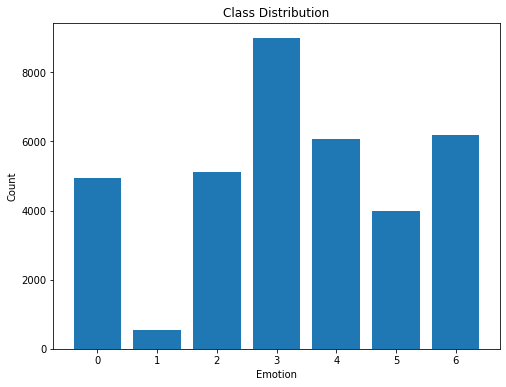

<h1>
 Emotion Detection 
<h1>

## Overview
The aim of the project is to display facial expressions (happy, sad, anger, fear, disgust, surprise, neutral) by performing fast & accurate face detection with OpenCV using a deep learning face detector model.

The model is trained on the FER-2013 dataset which was published on International Conference on Machine Learning (ICML). This dataset consists of 35887 grayscale, 48x48 sized face images with seven emotions - angry, disgusted, fearful, happy, neutral, sad and surprised.

## Methodology
1. **Load and preprocess the dataset:** Use the Fer2013 dataset, which contains images of faces categorized into seven emotions (angry, disgusted, fearful, happy, neutral, sad, surprised). Load the images and their corresponding labels, then preprocess the images by resizing them to the appropriate size and normalizing their pixel values.
2. **Performing Exploratory Data Analysis (EDA) to the given dataset:**

        **(0=Angry, 1=Disgust, 2=Fear, 3=Happy, 4=Sad, 5=Surprise, 6=Neutral)**

3. **Split the dataset into training, validation, and test sets:** divide the dataset into three sets - training, validation, and test sets. The training set is used to train the model, the validation set is used to evaluate the model's performance during training.
4. **Define the architecture of the neural network (e.g., convolutional neural network)**

        _________________________________________________________________
        Layer (type)                Output Shape              Param #    
        =================================================================
        conv2d (Conv2D)             (None, 46, 46, 64)        640       
                                                                 
        conv2d_1 (Conv2D)           (None, 44, 44, 64)        36928     
                                                                 
        max_pooling2d (MaxPooling2D)  (None, 22, 22, 64)       0         
                                                                                                                            
        dropout_2 (Dropout)         (None, 22, 22, 64)        0         
                                                                 
        conv2d_2 (Conv2D)           (None, 20, 20, 64)        36928     
                                                                 
        conv2d_3 (Conv2D)           (None, 18, 18, 64)        36928     
                                                                 
        max_pooling2d_1 (MaxPooling  (None, 9, 9, 64)         0         
        2D)                                                             
                                                                 
        dropout_3 (Dropout)         (None, 9, 9, 64)          0         
                                                                 
        conv2d_4 (Conv2D)           (None, 7, 7, 128)         73856     
                                                                 
        conv2d_5 (Conv2D)           (None, 5, 5, 128)         147584    
                                                                 
        max_pooling2d_2 (MaxPooling  (None, 2, 2, 128)        0         
        2D)                                                             
                                                                 
        flatten (Flatten)           (None, 512)               0         
                                                                 
        dense_1 (Dense)             (None, 1024)              525312    
                                                                 
        dropout_4 (Dropout)         (None, 1024)              0         
                                                                 
        dense_2 (Dense)             (None, 1024)              1049600   
                                                                 
        dropout_5 (Dropout)         (None, 1024)              0         
                                                                 
        dense_3 (Dense)             (None, 7)                 7175      
                                                                 
        =================================================================
        Total params: 1,914,951
        Trainable params: 1,914,951
        Non-trainable params: 0
        _________________________________________________________________

5. **Train the model on the training set**
6. **Evaluate the model on the validation set**
7. **Test the model on the testing set**

## Dataset & Description

The data consists of **48x48 pixel grayscale images** of faces. The faces have been automatically registered so that the face is more or less centred and occupies about the same amount of space in each image.
The training set consists of 28,709 examples and the public test set consists of 3,589 examples.

[Dataset link ](https://www.kaggle.com/msambare/fer2013)

## Business Segments
1. Facial Recognition
2. Speech and Voice Recognition
3. Bio-sensing
4. AI application
    - Government
    - Healthcare
    - Retail
    - Entertainment
    - Transportation
    - Other End-user Verticals
  

<!-- Papers -->
## Papers

- [Very deep convolutional networks for large-scale image recognition](https://arxiv.org/pdf/1409.1556.pdf) by Karen Simonyan & Andrew Zisserman

- [Challenges in Representation Learning: A report on three machine learning contests](https://arxiv.org/pdf/1307.0414v1.pdf) by Ian J. Goodfellow, Dumitru Erhan, Pierre Luc Carrier, Aaron Courville, Mehdi Mirza, Ben Hamner, Will Cukierski, Yichuan Tang, David Thaler, Dong-Hyun Lee, Yingbo Zhou, Chetan Ramaiah, Fangxiang Feng, Ruifan Li, Xiaojie Wang, Dimitris Athanasakis, John Shawe-Taylor, Maxim Milakov, John Park, Radu Ionescu, Marius Popescu, Cristian Grozea, James Bergstra, Jingjing Xie, Lukasz Romaszko, Bing Xu, Zhang Chuang, and Yoshua Bengio

## Contributer
[Chandan Soren](https://github.com/csoren66)

## Demo
[link](https://drive.google.com/file/d/1YShNLcqdjTcgyRFq_fEHc4Yqz_z9MnqC/view?usp=sharing)
